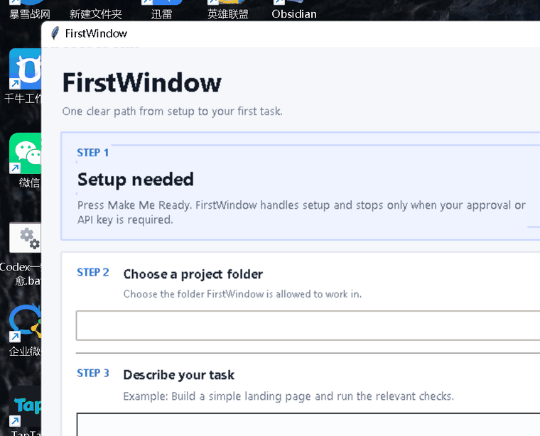

# FirstWindow

<p align="center">
  <strong>Your first coding agent for Windows.</strong><br>
  Three steps: get ready → pick a folder → describe the task.
</p>

<p align="center">
  <a href="https://github.com/wookzzz57-beep/first-window/releases/latest"></a>
  <a href="https://github.com/wookzzz57-beep/first-window/actions/workflows/ci.yml"></a>
  <a href="https://github.com/wookzzz57-beep/first-window/actions/workflows/windows-build.yml"></a>
  <a href="LICENSE"></a>
</p>

<p align="center">
  <a href="https://github.com/wookzzz57-beep/first-window/releases/latest/download/FirstWindow-Windows-x64.exe"><strong>Download Windows</strong></a>
  ·
  <a href="https://firstwindow-public.vercel.app">Website</a>
  ·
  <a href="docs/BEGINNER.md">Beginner Guide</a>
  ·
  <a href="https://github.com/wookzzz57-beep/first-window/releases/latest">Release Notes</a>
</p>

FirstWindow is a beginner-first Windows launcher for coding agents. The default screen is deliberately small: **get ready, choose a project folder, describe the task, Start**. Provider/runtime details stay under Advanced setup unless you need them.

## Start in 3 steps

1. Download and open **[FirstWindow-Windows-x64.exe](https://github.com/wookzzz57-beep/first-window/releases/latest/download/FirstWindow-Windows-x64.exe)**.
2. Press **Make Me Ready / 一键就绪**. FirstWindow checks the setup and runs a real readiness probe before Start is enabled.
3. Choose your project folder, describe what you want in plain language, and press **Start / 开始**.

No terminal is required for the normal Windows flow. If an interrupted task is found, FirstWindow can offer **Continue / 继续** after the exact execution route is verified again.

The community EXE is currently **unsigned**, so Windows SmartScreen may show an unknown-publisher warning. For integrity verification, compare the EXE with **[SHA256SUMS.txt](https://github.com/wookzzz57-beep/first-window/releases/latest/download/SHA256SUMS.txt)**.

Under the simple surface, **Hermes Agent** remains the executor. **Agnes API** can be the cloud provider lane and a ready **Hermes Managed Local** model can be the local lane. If no verified free/local route is ready, FirstWindow **blocks instead of silently falling back to paid or unknown-cost inference**.

> Direct Agnes CLI is not required for the beginner path. It remains an explicit advanced/manual option.

## See it running

This is a real capture of the **v0.4.2 Windows app**, showing both **English** and **简体中文** from the packaged release EXE. It is not a generated mockup.



## Why FirstWindow exists

Coding agents are powerful, but the first-run experience can still require users to understand providers, API billing, terminals, local models, recovery state, and whether “done” actually means the task is correct.

FirstWindow concentrates those concerns into one guarded workflow:

| Problem | FirstWindow behavior |
| --- | --- |
| “Which provider will this use, and can it cost money?” | **Fail closed.** Unknown-cost routes are blocked. |
| “The agent stopped halfway through.” | **Durable task + checkpoint + resume state.** |
| “The agent said done. Is the result actually correct?” | **Evidence-based acceptance.** Executor success alone is not verification. |
| “I do not want my other provider keys leaking into this setup.” | **Isolated Hermes profile** with explicit credential boundaries. |
| “I just want to start from Windows.” | **GUI-first beginner flow** with English / 简体中文 switching. |

Full setup details and troubleshooting: **[Beginner Guide](docs/BEGINNER.md)**.

## What is verified in v0.4.2

The current released baseline has been checked beyond “the build succeeded”:

- real **Hermes Agent → Agnes API** readiness and task execution on Windows
- credential-bound route proof and provider/model usage attestation
- fail-closed behavior when a verified free/local route is unavailable
- packaged Windows EXE self-test and bilingual UI self-test
- independent Release EXE ↔ `SHA256SUMS.txt` verification
- durable task/checkpoint/evidence flow
- independent acceptance gate: agent exit 0 does **not** automatically mean VERIFIED

**Managed Local note:** the routing/readiness path is supported when a validated local model is ready. The current release does not claim a completed real-device Managed Local inference E2E on the validation machine.

## Execution architecture

```text
                    ┌─────────────────────────────┐
                    │         FirstWindow         │
                    │ onboarding · routing ·      │
                    │ checkpoints · evidence      │
                    └──────────────┬──────────────┘
                                   │
                            Hermes Agent
                          ┌────────┴────────┐
                          │                 │
                     Agnes API       Managed Local
                    cloud lane       local lane
                          │                 │
                          └────────┬────────┘
                                   │
                         checkpoint + evidence
                                   │
                              VERIFIED?
```

FirstWindow owns the control surface and acceptance state. Hermes owns agent execution.

For the Agnes route, FirstWindow creates an isolated Hermes profile named `firstwindowzero`, disables fallback providers, requires explicit free-route confirmation, runs a live readiness probe, and validates usage evidence against the expected provider/model.

Changing or removing the Agnes credential invalidates the old route proof.

## “Done” is not proof

Each task stores repository-local durable state under `.firstwindow/tasks/<task_id>/`, including:

- objective and acceptance criteria
- checkpoint and next action
- append-only evidence
- execution/provider attestation
- resume context

The default beginner task separates:

- **AC-001** — the agent process completed through the verified execution route
- **AC-002** — the requested task outcome was independently verified

A successful agent run can cover AC-001. It cannot cover AC-002 just by saying “done”.

```text
Agent finished
    ↓
AC-001 covered
    ↓
Independent check required
    ↓
AC-002 covered
    ↓
VERIFIED
```

## Core features

- Windows GUI-first workflow
- English / 简体中文 live switching
- Diagnose
- Make Me Ready / 一键就绪
- Hermes Agent → Agnes API cloud lane
- Hermes Managed Local lane when a validated model is ready
- strict no-silent-fallback $0 guard
- isolated FirstWindow Hermes profile
- real readiness probe + usage attestation
- project-directory pinning
- durable checkpoints and Resume
- evidence ledger and acceptance coverage
- packaged Windows x64 EXE + SHA-256 checksum

<details>
<summary><strong>Install from source</strong></summary>

```bash
python -m venv .venv

# Windows
.venv\Scripts\activate

# macOS/Linux
source .venv/bin/activate

pip install -e .
firstwindow doctor
firstwindow-gui
```

</details>

<details>
<summary><strong>Advanced CLI examples</strong></summary>

```bash
firstwindow setup
firstwindow setup --install hermes --yes
firstwindow demo

firstwindow run "Add a /health endpoint and test it" \
  --accept "tests pass" \
  --accept "GET /health returns 200"

firstwindow tasks --project .
firstwindow resume <task_id> --project .
firstwindow evidence <task_id> --criterion AC-001 --kind test --detail "tests passed"
firstwindow evidence <task_id> --criterion AC-002 --kind probe --detail "GET /health -> 200"
firstwindow verify <task_id>
```

</details>

## Security and cost boundaries

FirstWindow intentionally does **not**:

- silently choose an unknown-cost provider
- clone a user's general Hermes provider credentials into its isolated profile
- treat configuration as proof of readiness
- treat agent exit 0 as proof of task completion
- silently switch providers after Agnes authentication fails
- claim Managed Local inference was verified when a validated local model was not available

See **[docs/BEGINNER.md](docs/BEGINNER.md)** for the full credential, route, and verification flow.

## Feedback and community

FirstWindow is still early. The most useful feedback is concrete: where onboarding was confusing, what failed on a real Windows machine, and which check prevented or missed a bad outcome.

- **Bug or setup problem:** [Open an issue](https://github.com/wookzzz57-beep/first-window/issues/new)
- **Questions / ideas:** [GitHub Discussions](https://github.com/wookzzz57-beep/first-window/discussions)
- **Latest binary:** [GitHub Releases](https://github.com/wookzzz57-beep/first-window/releases/latest)

If FirstWindow is useful to you—or you want to follow the experiment—**star the repository**. It helps other beginner agent users discover the project.

## License

MIT.
